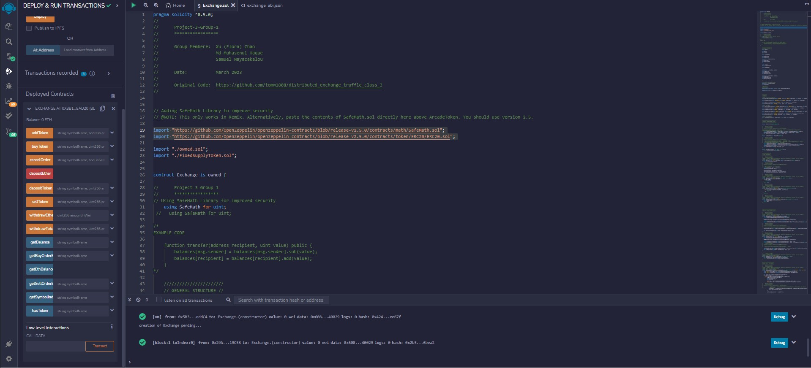
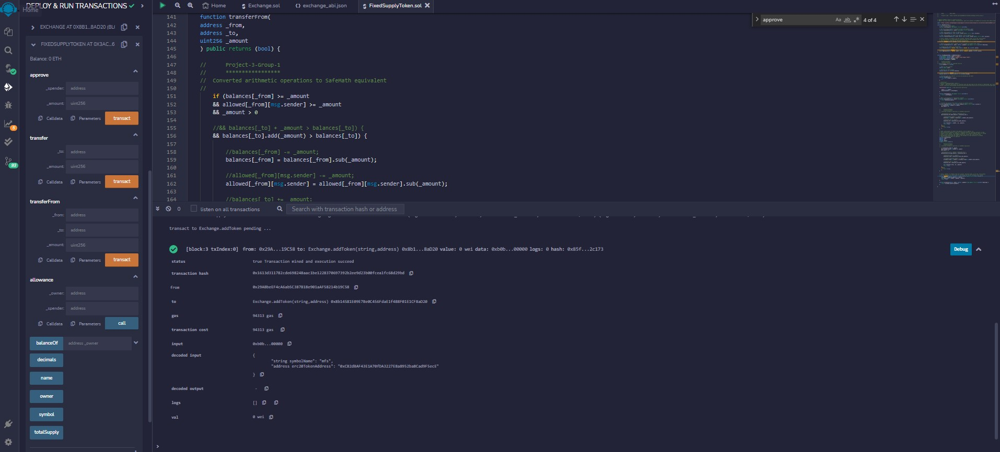
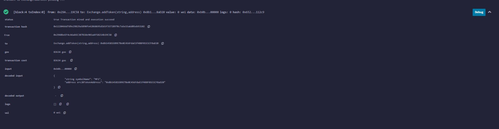
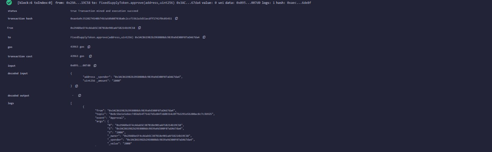
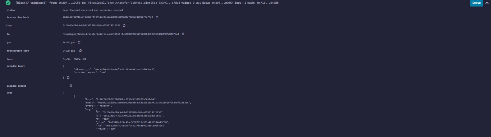

# Bootcamp Project 3: Decentralized Trading Platform Token and Coin trading with Etherium  

  

## Executive summary: 
The decentralized exchange can create non-fangible token using the etherium block chain technology. Through this exchange we can deposit ettherium in wallet, add token in the wallet through smart contract, then approve the added token in the wallet, can transfer from one address to another. Customer's loyalty programs can be done though the exchange where we issue token. Later this token can be applied to purchase different services. 

 
## Origin of the Project Concept 
The idea of the project is to create a platform where people can trade coins and token within Etherium Technology.  We thought of a decentralized trading platform for trading coins and tokens. After research, we found there was already a project created by Thomas Wiesner regarding this matter where the front end is developed with .js file. We thought of understanding the proejct and communicating with streamlit front end. 

## Data Collection, Cleanup, and Exploration:
We have reseached on available git hub libraries and found an wonderful work done by "Thomas Wiesne" on decentralized excahgne. The project files are in the following link. 

https://github.com/tomw1808/distributed_exchange_truffle_class_3

## Approach
Our approach was try to understand the functionalities of the decentralized prject and then use the steamlit front end which is tought in the course to connect front end with the back end. We tried to understand and upgrade the codes from  

## Demo

### Successfull Deployment of Codes in Remix Development Environment
  
  

### Successfull Transaction of in the Exchange 

### Sucessfully added token
  

### Sucessfully approved token
  

### Successfully transferred Token
  

### Successfully Deposited Ether
  

## Team

### Team Memebers Flora Zhao, Samuel Apakuki Nayacakalou, Md Muhasenul Haque

     
     
     

### Course Instructor 
### Adrian Rusli
  

### and Larry Hang
  

## References 
Imported SafeMath from 
import "https://github.com/OpenZeppelin/openzeppelin-contracts/blob/release-v2.5.0/contracts/math/SafeMath.sol";

Imported ERC20.sol
import "https://github.com/OpenZeppelin/openzeppelin-contracts/blob/release-v2.5.0/contracts/token/ERC20/ERC20.sol";

## Difficulties Faced 
We faced a bit of the difficulty in deplying the project beacuse of differnet versions of solidity. We tried checked and upgraded with recent solidy version. 

We faced a bit of difficulty in interacting the back end with the front end. We could debug the issue with breaking the code in steps. 

## Future Scope of Work

Creating mobile app to interact with the clients for the front end. 
Going for Initial Coin Offerings for the new coins introduced in the exchange. 

## Conclusion 
We could make the decentralized exchange with the front end of steamlit which can transact any kind of ether and tokens using etherium techonology. The exchange can also create token, buy, sell and transfer token . 

## References 
Imported SafeMath from 
import "https://github.com/OpenZeppelin/openzeppelin-contracts/blob/release-v2.5.0/contracts/math/SafeMath.sol";

Imported ERC20.sol
import "https://github.com/OpenZeppelin/openzeppelin-contracts/blob/release-v2.5.0/contracts/token/ERC20/ERC20.sol";
